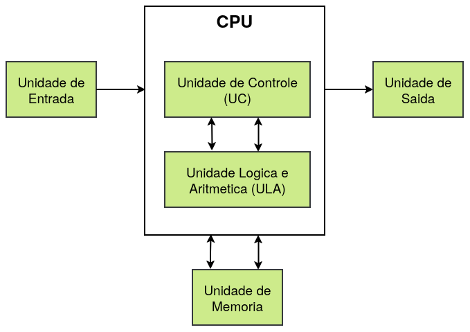

# Prática em Sistemas Digitais - SSC0108

## Projeto final

Este trabalho consiste no desenvolvimento de um processador digital simples, implementado em VHDL. O objetivo principal é criar uma CPU funcional, capaz de realizar operações aritméticas, lógicas, de controle de fluxo e interação com a placa FPGA, utilizando uma arquitetura básica com barramentos e componentes bem definidos.

### Instruções

Cada instrução possui 8 bits e apenas 3 registradores manipuláveis, por isso decidimos dividir os bits da seguinte maneira:

|Opcode|Registrador 1 | Registrador 2|
| :--: | :--: | :--: |
|0000|00|00|

* Opcode: código de instrução.
* Registrador 1: operando A da instrução.
* Registrador 2: operando B da instrução.

As instruções que o processador deve executar são:

* ADD: realiza a operação de soma entre dois registradores ou um registrador e um número imediato, armazenando o resultado no registrador R.
* SUB: realiza a operação de subtração entre dois registradores ou um registrador e um número imediato, armazenando o resultado no registrador R.
* AND: realiza a operação lógica AND bit a bit entre dois registradores ou um registrador e um número imediato, armazenando o resultado no registrador R.
* OR: realiza a operação lógica OR bit a bit entre dois registradores ou um registrador e um número imediato, armazenando o resultado no registrador R.
* NOT: realiza a operação lógica NOT entre um valor contido em um registrador ou um valor imediato, armazenando o resultado no registrador R.
* CMP: compara os valores contidos em registradores ou imediatos e armazena as flags nos registradores.
* JMP: altera o fluxo de execução para o endereço indicado na instrução.
* JEQ: altera o fluxo de execução para o endereço indicado na instrução, caso a última comparação tenha resultado em A=B.
* JGR: altera o fluxo de execução para o endereço indicado na instrução, caso a última comparação tenha resultado em A>B.
* LOAD: carrega um dado da memória para um registrador, de acordo com o endereço indicado. 
* STORE: armazena um dado no endereço de memória indicado.
* IN: armazena o valor de entrada em um dos registradores.
* OUT: envia o valor contido em um registrador para os leds.
* WAIT: espera pela ação do usuário.

Códigos das instruções:

|Instrução|ADD|SUB|AND|OR|NOT|CMP|JMP|JEQ|JGR|LOAD|STORE|MOV|IN|OUT|WAIT|
|:--:|:--:|:--:|:--:|:--:|:--:|:--:|:--:|:--:|:--:|:--:|:--:|:--:|:--:|:--:|:--:|
|Opcode|0000|0001|0010|0011|0100|0101|0110|0111|1000|1001|1010|1011|1100|1101|1110|


Como a memória possui 8 bits de endereçamento e cada dado também possui 8 bits, em instruções que envolvem valores imediatos, é necessário usar duas instruções.

## Componentes

A arquitetura  do processador é composta por quatro elementos fundamentais: os registradores, que armazenam temporariamente dados e instruções; a memória, responsável por guardar informações de forma acessível ao processador; a unidade de controle, que coordena as operações e interpreta as instruções; e a Unidade Lógica e Aritmética (ULA), que executa cálculos matemáticos e operações lógicas.

### Registradores
Um **registrador** é um pequeno e rápido espaço de armazenamento dentro da CPU, usado para guardar temporariamente dados e instruções em processamento. Ele acelera as operações ao fornecer acesso imediato à ALU, armazenar resultados intermediários e controlar o fluxo de execução com funções específicas, como manter o endereço da próxima instrução ou operar diretamente sobre operandos. Essencial para o desempenho do processador, os registradores minimizam a dependência da memória principal e garantem eficiência nas operações computacionais.

No processador em construção, são implementados seis registradores de 8 bits, cada um com uma função específica: o PC (Program Counter) mantém o endereço da próxima instrução; o IR (Instruction Register) armazena a instrução em execução; os RegA e RegB operam diretamente sobre operandos; o RegR guarda resultados intermediários; e o RegOut gerencia a saída de dados. E ainda, quatro registradores de 1 bit, sendo eles: Zero, Over, Sinal e Carry.

#### Resgistrador de 8 bits
```VHDL
library ieee;
use ieee.std_logic_1164.all;

entity reg is
    port(
        data_in: in std_logic_vector(7 downto 0);
        rst: in std_logic;
        load: in std_logic;
        data_out: out std_logic_vector(7 downto 0)
    );
end reg;

architecture behavior of reg is
    signal temp: std_logic_vector(7 downto 0) := (others => '0');

begin
    process(rst, load)
    begin
        if rst = '1' then
            temp <= (others => '0');
        elsif load = '1' then
            temp <= data_in;
        end if;
    end process;

    data_out <= temp;
end behavior;
```

#### Registrador de 1 bit
```VHDL
library ieee;
use ieee.std_logic_1164.all;

entity flag_reg is
    port(
        data_in: in std_logic;
        rst: in std_logic;
        load: in std_logic;
        data_out: out std_logic
    );
end flag_reg;

architecture behavior of flag_reg is
    signal temp: std_logic := '0';

begin
    process(rst, load)
    begin
        if rst = '1' then
            temp <= '0';
        elsif load = '1' then
            temp <= data_in;
        end if;
    end process;

    data_out <= temp;
end behavior;
```

### Memória
A **memória** de um computador é o componente responsável por armazenar dados e instruções que serão processados pela CPU. Ela pode ser dividida em níveis, como memória principal (RAM), usada para acesso rápido e temporário durante a execução de programas, e armazenamento secundário (HD ou SSD), que guarda informações de forma permanente. A memória fornece os dados que o processador necessita para realizar operações, sendo essencial para o funcionamento do sistema, pois conecta o armazenamento mais lento ao processamento rápido, garantindo acesso eficiente às informações. O processador possui apenas uma memória(RAM).

#### Memória 256x8
```VHDL
library ieee;
use ieee.std_logic_1164.all;

entity Memoria is
	port(address : IN STD_LOGIC_VECTOR (7 DOWNTO 0);
		  clock : IN STD_LOGIC := '1';
	  	  data : IN STD_LOGIC_VECTOR (7 DOWNTO 0);
		  wren : IN STD_LOGIC ;
		  q : OUT STD_LOGIC_VECTOR (7 DOWNTO 0) );
end Memoria;

architecture be of Memoria is
	
	component ram256x8
		PORT ( address : IN STD_LOGIC_VECTOR (7 DOWNTO 0);
				 clock : IN STD_LOGIC := '1';
				 data : IN STD_LOGIC_VECTOR (7 DOWNTO 0);
				 wren : IN STD_LOGIC ;
				 q : OUT STD_LOGIC_VECTOR (7 DOWNTO 0) );
	end component;
	
begin

	inst1: ram256x8
	port map(address => address,
				clock => clock,
				data => data,
				wren => wren,
				q => q);

end be;
```

### ULA
A **Unidade Lógica e Aritmética (ULA)** é um componente fundamental da CPU, responsável por realizar operações matemáticas (como adição e subtração) e lógicas (como comparações e operações AND/OR). Ela recebe os dados dos registradores, executa os cálculos ou decisões lógicas e retorna os resultados para serem armazenados ou utilizados em outras instruções. Essencial para a execução de tarefas computacionais, a ULA é o núcleo onde os dados brutos se transformam em informações úteis no processamento.

```VHDL
library ieee;
use ieee.std_logic_1164.all;
use ieee.numeric_std.all;

entity ula is
    port(
        A: in std_logic_vector(7 downto 0);
        B: in std_logic_vector(7 downto 0);
        aluop: in std_logic_vector(2 downto 0);
        C: out std_logic_vector(7 downto 0);
        overflow: out std_logic;
        sinal: out std_logic;
        zero: out std_logic;
        carry: out std_logic
    );
end ula;

architecture behavior of ula is
	
	signal temp1, temp2: std_logic_vector(8 downto 0);
	signal carry1, carry2: std_logic;
	
begin
    process(A, B, aluop)
    begin
        case aluop is
            when "000" =>  -- Adição
                temp1 <= std_logic_vector(signed('0' & A) + signed('0' & B));
					 temp2 <= std_logic_vector(signed("00" & A(6 downto 0))+signed("00" & B(6 downto 0)));
                carry1 <= temp1(8);
					 carry2 <= temp2(7);
                C <= temp1(7 downto 0);
					 carry <= carry1;
					 if(carry1 /= carry2) then
						overflow <= '1';
					 else
						overflow <= '0';
					 end if;
                
            when "001" =>  -- Subtração
                temp1 <= std_logic_vector(signed('0' & A) - signed('0' & B));
					 temp2 <= std_logic_vector(signed("00" & A(6 downto 0))-signed("00" & B(6 downto 0)));
                carry1 <= temp1(8);
					 carry2 <= temp2(7);
                C <= temp1(7 downto 0);
					 carry <= carry1;
					 if(carry1 /= carry2) then
						overflow <= '1';
					 else
						overflow <= '0';
					 end if;
                
            when "010" =>  -- AND
                C <= A and B;
                carry <= '0';
                overflow <= '0';

            when "011" =>  -- OR
                C <= A or B;
                carry <= '0';
                overflow <= '0';

            when "100" =>  -- NOT A
                C <= not B;
                carry <= '0';
                overflow <= '0';

            when others =>
                C <= (others => '0');
                carry <= '0';
                overflow <= '0';
        end case;

        sinal <= temp1(7);
		  if(temp1(7 downto 0) = "00000000") then
				zero <= '1';
		  else
				zero <= '0';
        end if;
    end process;

end behavior;
```

### Unidade de controle
A **Unidade de Controle (UC)** é o componente da CPU responsável por coordenar e gerenciar todas as operações do processador. Ela interpreta as instruções de um programa, controla o fluxo de dados entre a memória, a ULA e os registradores, e garante que as operações sejam executadas na ordem correta. A UC emite sinais de controle para ativar os componentes apropriados e sincroniza as atividades do sistema, garantindo o funcionamento eficiente e ordenado do processamento. Responsável por coordenar as ações do processador.


## Integração

A integração dos componentes de um processador em VHDL é uma etapa crucial para garantir que todas as unidades funcionem em harmonia, permitindo a execução correta das instruções. Cada componente, como a Unidade de Controle (UC), a Unidade Lógica e Aritmética (ULA) e a Memória, desempenha um papel específico no ciclo de instruções. A seguir tem-se um diagrama básico da configuração geral de um Processador, com seus componentes internos: 

<p align="center">
  
</p>

Para o bom funcionamento do processador, decidimos usar a seguinte arquitetura:


Códigos da instruções

|Opcode|Instrução|
|:--:|:--:|
|0000|ADD|
|0001|SUB|
|0010|AND|
|0011|OR|
|0100|NOT|
|0101|CMP|
|0110|JMP|
|0111|JEQ|
|1000|JGR|
|1001|LOAD|
|1010|STORE|
|1011|MOV|
|1100|IN|
|1101|OUT|
|1110|WAIT|


Estados

* Ini: zera os registradores
* Busca: leitura da memória e escrita no IR
* Dec: decodificação de instrução
* R-type: execução das instruções add, sub, or e and.
  * R_dec, R_exec, R_exec_imm
* Not: execução da instrução not
* ...
* Pc: atualização do pc

| Estado | rst | load_pc | mem_read | mem_write | mem_en | mem_src1 | mem_src2 | load_ir | A_src | B_src | in_en | load_A | load_B | alu_src1 | alu_src2 | aluop | R_src | load_R | load_overflow | load_sinal | load_zero | load_carry | out_src | load_out | jmp | jeq | jgr 
|  :--:  |:--:|:--:|:--:|:--:|:--:|:--:|:--:|:--:|:--:|:--:|:--:|:--:|:--:|:--:|:--:|:--:|:--:|:--:|:--:|:--:|:--:|:--:|:--:|:--:|:--:|:--:|:--:|
|ini               |1|0|0|0|0|000|00|0|00|00|0|0|0|    00     |    00     |    000    |00|0|0|0|0|0|00|0|0|0|0|
|busca             |0|0|1|0|1|000|00|1|00|00|0|0|0|    00     |    00     |    000    |00|0|0|0|0|0|00|0|0|0|0|
|dec               |0|0|0|0|1|000|00|0|00|00|0|0|0|    00     |    00     |    000    |00|0|0|0|0|0|00|0|0|0|0|
|R_dec             |0|0|0|0|1|000|00|0|00|00|0|0|0|    00     |    00     |    000    |00|0|0|0|0|0|00|0|0|0|0|
|R_exec            |0|0|0|0|1|000|00|0|00|00|0|0|0| inst[3-2] | inst[1-0] | inst[6-4] |00|1|0|0|0|0|00|0|0|0|0|
|R_exec_immA       |0|1|1|0|1|000|00|0|00|00|0|0|0|    00     |    11     | inst[6-4] |00|1|0|0|0|0|00|0|0|0|0|
|R_exec_immB       |0|1|1|0|1|000|00|0|00|00|0|0|0|    01     |    11     | inst[6-4] |00|1|0|0|0|0|00|0|0|0|0|
|R_exec_immR       |0|1|1|0|1|000|00|0|00|00|0|0|0|    10     |    11     | inst[6-4] |00|1|0|0|0|0|00|0|0|0|0|
|Not_dec           |0|0|0|0|1|000|00|0|00|00|0|0|0|    00     |    00     |    000    |00|0|0|0|0|0|00|0|0|0|0|
|Not_exec          |0|0|0|0|1|000|00|0|00|00|0|0|0| inst[3-2] |    00     | inst[6-4] |00|1|0|0|0|0|00|0|0|0|0|
|Not_exec_imm      |0|1|1|0|1|000|00|0|00|00|0|0|0|    11     |    00     | inst[6-4] |00|1|0|0|0|0|00|0|0|0|0|
|Cmp_dec           |0|0|0|0|1|000|00|0|00|00|0|0|0|    00     |    00     |    000    |00|0|0|0|0|0|00|0|0|0|0|
|Cmp_exec          |0|0|0|0|1|000|00|0|00|00|0|0|0| inst[3-2] | inst[1-0] |    001    |00|0|1|1|1|1|00|0|0|0|0|
|Cmp_exec_immA     |0|1|1|0|1|000|00|0|00|00|0|0|0|    00     |    11     |    001    |00|0|1|1|1|1|00|0|0|0|0|
|Cmp_exec_immB     |0|1|1|0|1|000|00|0|00|00|0|0|0|    01     |    11     |    001    |00|0|1|1|1|1|00|0|0|0|0|
|Cmp_exec_immR     |0|1|1|0|1|000|00|0|00|00|0|0|0|    10     |    11     |    001    |00|0|1|1|1|1|00|0|0|0|0|
|jmp_dec           |0|1|1|0|1|000|00|0|00|00|0|0|0|    00     |    00     |    000    |00|0|0|0|0|0|00|0|0|0|0|
|jmp_exec          |0|1|0|0|1|000|00|0|00|00|0|0|0|    00     |    00     |    000    |00|0|0|0|0|0|00|0|1|0|0|
|jeq_dec           |0|1|1|0|1|000|00|0|00|00|0|0|0|    00     |    00     |    000    |00|0|0|0|0|0|00|0|0|0|0|
|jeq_exec          |0|1|1|0|1|000|00|0|00|00|0|0|0|    00     |    00     |    000    |00|0|0|0|0|0|00|0|0|1|0|
|jgq_dec           |0|1|1|0|1|000|00|0|00|00|0|0|0|    00     |    00     |    000    |00|0|0|0|0|0|00|0|0|0|0|
|jgq_exec          |0|1|1|0|1|000|00|0|00|00|0|0|0|    00     |    00     |    000    |00|0|0|0|0|0|00|0|0|0|1|
|load_dec          |0|0|0|0|0|000|00|0|00|00|0|0|0|    00     |    00     |    000    |00|0|0|0|0|0|00|0|0|0|0|
|load_exec_imm_A   |0|1|1|0|1|001|00|0|10|00|0|1|0|    00     |    00     |    000    |00|0|0|0|0|0|00|0|0|0|0|
|load_exec_imm_B   |0|1|1|0|1|001|00|0|00|10|0|0|1|    00     |    00     |    000    |00|0|0|0|0|0|00|0|0|0|0|
|load_exec_imm_R   |0|1|1|0|1|001|00|0|00|00|0|0|0|    00     |    00     |    000    |11|1|0|0|0|0|00|0|0|0|0|
|load_exec_A_A     |0|0|1|0|1|010|00|0|10|00|0|1|0|    00     |    00     |    000    |00|0|0|0|0|0|00|0|0|0|0|
|load_exec_A_B     |0|0|1|0|1|011|00|0|10|00|0|1|0|    00     |    00     |    000    |00|0|0|0|0|0|00|0|0|0|0|
|load_exec_A_R     |0|0|1|0|1|100|00|0|10|00|0|1|0|    00     |    00     |    000    |00|0|0|0|0|0|00|0|0|0|0|
|load_exec_B_A     |0|0|1|0|1|010|00|0|00|10|0|0|1|    00     |    00     |    000    |00|0|0|0|0|0|00|0|0|0|0|
|load_exec_B_B     |0|0|1|0|1|011|00|0|00|10|0|0|1|    00     |    00     |    000    |00|0|0|0|0|0|00|0|0|0|0|
|load_exec_B_R     |0|0|1|0|1|100|00|0|00|10|0|0|1|    00     |    00     |    000    |00|0|0|0|0|0|00|0|0|0|0|
|load_exec_R_A     |0|0|1|0|1|010|00|0|00|00|0|0|0|    00     |    00     |    000    |11|1|0|0|0|0|00|0|0|0|0|
|load_exec_R_B     |0|0|1|0|1|011|00|0|00|00|0|0|0|    00     |    00     |    000    |11|1|0|0|0|0|00|0|0|0|0|
|load_exec_R_R     |0|0|1|0|1|100|00|0|00|00|0|0|0|    00     |    00     |    000    |11|1|0|0|0|0|00|0|0|0|0|
|store_dec         |0|0|0|0|0|000|00|0|00|00|0|0|0|    00     |    00     |    000    |00|0|0|0|0|0|00|0|0|0|0|
|store_exec_A      |0|0|0|0|0|000|00|0|00|00|0|0|0|    00     |    00     |    000    |00|0|0|0|0|0|00|0|0|0|0|
|Pc                |0|1|0|0|1|000|00|0|00|00|0|0|0|    00     |    00     |    000    |00|0|0|0|0|0|00|0|0|0|0|


link whiteboard com o circuito:
https://wbd.ms/share/v2/aHR0cHM6Ly93aGl0ZWJvYXJkLm1pY3Jvc29mdC5jb20vYXBpL3YxLjAvd2hpdGVib2FyZHMvcmVkZWVtLzczMDI5MGVlYzI2NjQxOThiZDFlMWZjNzA1MGM5Yzk2X0JCQTcxNzYyLTEyRTAtNDJFMS1CMzI0LTVCMTMxRjQyNEUzRF84MTUzNmViNy02MGQ1LTQ3ZmEtYWU5Mi0zZDYwMDk1NWExMDA=

### Sinais de controle
```VHDL
rst <= '0'
load_pc <= '0'
mem_read <= '0'
mem_write <= '0'
add_src <= "000"
data_src <= "00"
load_ir <= '0'
A_src <= "00"
B_src <= "00"
in_en <= '0'
load_A <= '0'
load_B <= '0'
alu_src1 <= "00"
alu_src2 <= "00"
aluop <= "000"
R_src <= "00"
load_r <= '0'
out_src <= "00"
load_out <= '0'
load_flag <= '0'
jmp <= '0'
jeq <= '0'
jgr <= '0'
```
### Código principal:
```vhdl
library ieee;
use ieee.std_logic_1164.all;
use ieee.numeric_std.all;

entity processador is
    port(sw: in std_logic_vector(7 downto 0);
        clk: in std_logic;    
       leds: out std_logic_vector(7 downto 0);
		    q: out std_logic_vector(13 downto 0); 
			 p: out std_logic_vector(6 downto 0);
		    s: out std_logic_vector(6 downto 0);
			 u: out std_logic_vector(6 downto 0));
end entity;

architecture vamos_reprovar of processador is

    component registrador
        port(
				clk: in std_logic;
            data_in: in std_logic_vector(7 downto 0);
            rst: in std_logic;
            load: in std_logic;
            data_out: out std_logic_vector(7 downto 0)
        );
    end component;

    component flag_reg
        port(
            data_in: in std_logic;
            rst: in std_logic;
            load: in std_logic;
            data_out: out std_logic
        );
    end component;

    component ula
        port(
            A: in std_logic_vector(7 downto 0);
            B: in std_logic_vector(7 downto 0);
            aluop: in std_logic_vector(2 downto 0);
            C: out std_logic_vector(7 downto 0);
            overflow: out std_logic;
            sinal: out std_logic;
            zero: out std_logic;
            carry: out std_logic
        );
    end component;

    component controle
        port(inst: in std_logic_vector(7 downto 0);
              clk: in std_logic;    
				  estado: out std_logic_vector(4 downto 0);
      control_bus: out std_logic_vector(32 downto 0));
    end component;

    component Memoria
        port(address : IN STD_LOGIC_VECTOR (7 DOWNTO 0);
               clock : IN STD_LOGIC;
                data : IN STD_LOGIC_VECTOR (7 DOWNTO 0);
                wren : IN STD_LOGIC;
                   q : OUT STD_LOGIC_VECTOR (7 DOWNTO 0) );
    end component;
	 
	 component mux2x1
    port(entrada1: in std_logic_vector(7 downto 0);
        entrada2: in std_logic_vector(7 downto 0);
        seletor: in std_logic;
        saida: out std_logic_vector(7 downto 0));
	 end component;
	 
	 component mux4x1
        port(
        entrada1: in std_logic_vector(7 downto 0);
        entrada2: in std_logic_vector(7 downto 0);
        entrada3: in std_logic_vector(7 downto 0);
        entrada4: in std_logic_vector(7 downto 0);
        seletor: in std_logic_vector(1 downto 0);
        saida: out std_logic_vector(7 downto 0)
    );
    end component;
	 
	 component mux6x1
        port(
        entrada1: in std_logic_vector(7 downto 0);
        entrada2: in std_logic_vector(7 downto 0);
        entrada3: in std_logic_vector(7 downto 0);
        entrada4: in std_logic_vector(7 downto 0);
        entrada5: in std_logic_vector(7 downto 0);
        entrada6: in std_logic_vector(7 downto 0);
        seletor: in std_logic_vector(2 downto 0);
        saida: out std_logic_vector(7 downto 0)
	 );
    end component;
	 
	 component display
	    port(
            S0,S1,S2,S3: in std_logic;
    	    P0,P1,P2,P3,P4,P5,P6: out std_logic
        );
    end component;

    signal PC_out, MEM_address, MEM_data, MEM_out, IR_out, PC_add, jump, jumpeq, jumpgr,
            A_in, B_in, R_in, A_wire, B_wire, R_wire, A_out, B_out, R_out, ULA_inA, ULA_inB, ULA_out,
            out_in, out_out: std_logic_vector(7 downto 0);
    signal jmp, jeq, jgr, jeq_and, jgr_and, zero_ula, sinal_ula, carry_ula, over_ula, zero_out, sinal_out, carry_out, 
            over_out, in_en, mem_write : std_logic;
    signal load_pc, load_ir, load_A, load_B, load_R, load_flag, load_out, rst: std_logic;
    signal out_src, A_src, B_src, R_src, alu_src1, alu_src2, data_src: std_logic_vector(1 downto 0);
    signal add_src, aluop: std_logic_vector(2 downto 0);
	 signal control_bus: std_logic_vector(32 downto 0);
	 signal estado: std_logic_vector(4 downto 0);
begin

    mem: Memoria
    port map(
        address => MEM_address,
        clock => clk,
        data => MEM_data,
        wren => mem_write,
        q => MEM_out
    );

    uc: controle
    port map(
             inst => IR_out,
              clk => clk,    
				  estado => estado,
      control_bus => control_bus
    );

    pc: registrador
    port map(
			clk => clk,
        data_in => jumpgr, 
        rst => rst,
        load => load_pc,
        data_out => PC_out
    );

    ir: registrador
    port map(
			clk => clk,
        data_in => MEM_out, 
        rst => rst,
        load => load_ir,
        data_out => IR_out
    );

    regA: registrador
    port map(
			clk => clk,
        data_in => A_in, 
        rst => rst,
        load => load_A,
        data_out => A_out
    );

    regB: registrador
    port map(
			clk => clk,
        data_in => B_in, 
        rst => rst,
        load => load_B,
        data_out => B_out
    );

    regR: registrador
    port map(
			clk => clk,
        data_in => R_in, 
        rst => rst,
        load => load_R,
        data_out => R_out
    );

    regOut: registrador
    port map(
			clk => clk,
        data_in => out_in, 
        rst => rst,
        load => load_out,
        data_out => out_out
    );

    overflow: flag_reg
    port map(
        data_in => over_ula,
        rst => rst,
        load => load_flag,
        data_out => over_out 
    );

    sinal: flag_reg
    port map(
        data_in => sinal_ula,
        rst => rst,
        load => load_flag,
        data_out => sinal_out
    );

    carry: flag_reg
    port map(
        data_in => carry_ula,
        rst => rst,
        load => load_flag,
        data_out => carry_out
    );

    zero: flag_reg
    port map(
        data_in => zero_ula,
        rst => rst,
        load => load_flag,
        data_out => zero_out
    );

    alu: ula
    port map(
        A => ULA_inA,
        B => ULA_inB,
        aluop => aluop,
        C => ULA_out,
        overflow => over_ula,
        sinal => sinal_ula,
        zero => zero_ula,
        carry => carry_ula
    );
	 
	 m1: mux2x1
	 port map(
		  entrada1 => PC_add,
		  entrada2 => IR_out,
		  seletor => jmp,
		  saida => jump
	 );
	 
	 m2: mux2x1
	 port map(
		  entrada1 => jump,
		  entrada2 => IR_out,
		  seletor => jeq_and,
		  saida => jumpeq
	 );
	 
	 m3: mux2x1
	 port map(
		  entrada1 => jumpeq,
		  entrada2 => IR_out,
		  seletor => jgr_and,
		  saida => jumpgr
	 );
	 
	 m4: mux2x1
	 port map(
		  entrada1 => A_wire,
		  entrada2 => sw,
		  seletor => in_en,
		  saida => A_in
	 );
	 
	 m5: mux2x1
	 port map(
		  entrada1 => B_wire,
		  entrada2 => sw,
		  seletor => in_en,
		  saida => B_in
	 );
	 
	 m6: mux2x1
	 port map(
		  entrada1 => R_wire,
		  entrada2 => sw,
		  seletor => in_en,
		  saida => R_in
	 );
	 
	 m7: mux4x1
	 port map(
		  entrada1 => A_out,
		  entrada2 => B_out,
		  entrada3 => R_out,
		  entrada4 => "00000000",
		  seletor => data_src,
		  saida => MEM_data
	 );
	 
	 m8: mux4x1
	 port map(
		  entrada1 => "00000000",
		  entrada2 => B_out,
		  entrada3 => R_out,
		  entrada4 => MEM_out,
		  seletor => A_src,
		  saida => A_wire
	 );
	 
	 m9: mux4x1
	 port map(
		  entrada1 => A_out,
		  entrada2 => "00000000",
		  entrada3 => R_out,
		  entrada4 => MEM_out,
		  seletor => B_src,
		  saida => B_wire
	 );
	 
	 m10: mux4x1
	 port map(
		  entrada1 => A_out,
		  entrada2 => B_out,
		  entrada3 => ULA_out,
		  entrada4 => MEM_out,
		  seletor => R_src,
		  saida => R_wire
	 );
	 
	 m11: mux4x1
	 port map(
		  entrada1 => A_out,
		  entrada2 => B_out,
		  entrada3 => R_out,
		  entrada4 => "00000000",
		  seletor => alu_src1,
		  saida => ULA_inA
	 );
	 
	 m12: mux4x1
	 port map(
		  entrada1 => A_out,
		  entrada2 => B_out,
		  entrada3 => R_out,
		  entrada4 => MEM_out,
		  seletor => alu_src2,
		  saida => ULA_inB
	 );
	 
	 m13: mux4x1
	 port map(
		  entrada1 => A_out,
		  entrada2 => B_out,
		  entrada3 => R_out,
		  entrada4 => "00000000",
		  seletor => out_src,
		  saida => out_in
	 );
	 
	 m14: mux6x1
	 port map(
		  entrada1 => PC_out,
		  entrada2 => A_out,
		  entrada3 => B_out,
		  entrada4 => R_out,
		  entrada5 => MEM_out,
		  entrada6 => IR_out,
		  seletor => add_src,
		  saida => MEM_address
	 );
	 
	 d1: display
    port map(S0 => R_out(0),
            S1 => R_out(1),
            S2 => R_out(2),
            S3 => R_out(3),
            P0 => q(0),
            P1 => q(1),
            P2 => q(2),
            P3 => q(3),
            P4 => q(4),
            P5 => q(5),
            P6 => q(6)
    );

    d2: display
    port map(S0 => R_out(4),
            S1 => R_out(5),
            S2 => R_out(6),
            S3 => R_out(7),
            P0 => q(7),
            P1 => q(8),
            P2 => q(9),
            P3 => q(10),
            P4 => q(11),
            P5 => q(12),
            P6 => q(13)
    );
	 
	 d3: display
    port map(S0 => estado(0),
            S1 => estado(1),
            S2 => estado(2),
            S3 => estado(3),
            P0 => p(0),
            P1 => p(1),
            P2 => p(2),
            P3 => p(3),
            P4 => p(4),
            P5 => p(5),
            P6 => p(6)
    );
	 
	 
	 
	 d4: display
    port map(S0 => over_out,
            S1 => sinal_out,
            S2 => carry_out,
            S3 => zero_out,
            P0 => s(0),
            P1 => s(1),
            P2 => s(2),
            P3 => s(3),
            P4 => s(4),
            P5 => s(5),
            P6 => s(6)
    );
	 
	 d5: display
    port map(S0 => estado(4),
            S1 => '0',
            S2 => '0',
            S3 => '0',
            P0 => u(0),
            P1 => u(1),
            P2 => u(2),
            P3 => u(3),
            P4 => u(4),
            P5 => u(5),
            P6 => u(6)
    );
	 
    PC_add <= std_logic_vector(unsigned(PC_out)+1);
    jeq_and <= jeq and zero_out;
    jgr_and <= jgr and (not (A_out(7) xor sinal_out)) and (not zero_out);


    leds <= out_out;

	 rst <= control_bus(32);
	 load_pc <= control_bus(31);
	 mem_write <= control_bus(30);
	 add_src <= control_bus(29 downto 27);
	 data_src <= control_bus(26 downto 25);
	 load_ir <= control_bus(24);
	 A_src <= control_bus(23 downto 22);
	 B_src <= control_bus(21 downto 20);
	 in_en <= control_bus(19);
	 load_A <= control_bus(18);
	 load_B <= control_bus(17);
	 alu_src1 <= control_bus(16 downto 15);
	 alu_src2 <= control_bus(14 downto 13);
	 aluop <= control_bus(12 downto 10);
	 R_src <= control_bus(9 downto 8);
	 load_R <= control_bus(7);
	 out_src <= control_bus(6 downto 5);
	 load_out <= control_bus(4);
	 load_flag <= control_bus(3);
	 jmp <= control_bus(2);
	 jeq <= control_bus(1);
	 jgr <= control_bus(0);
	 
end vamos_reprovar;
```
### Mux2x1:
```VHDL
library ieee;
use ieee.std_logic_1164.all;

entity mux2x1 is
    port(
        entrada1: in std_logic_vector(7 downto 0);
        entrada2: in std_logic_vector(7 downto 0);
        seletor: in std_logic;
        saida: out std_logic_vector(7 downto 0)
    );
end mux2x1;

architecture behavior of mux2x1 is

begin

	process(seletor)
	begin
		if(seletor = '0') then
			saida <= entrada1;
		else
			saida <= entrada2;
		end if;
	end process;

end behavior;
```

### Mux4x1
```VHDL
library ieee;
use ieee.std_logic_1164.all;

entity mux4x1 is
    port(
        entrada1: in std_logic_vector(7 downto 0);
        entrada2: in std_logic_vector(7 downto 0);
        entrada3: in std_logic_vector(7 downto 0);
        entrada4: in std_logic_vector(7 downto 0);
        seletor: in std_logic_vector(1 downto 0);
        saida: out std_logic_vector(7 downto 0)
    );
end mux4x1;

architecture behavior of mux4x1 is

begin

	process(seletor)
	begin
		case(seletor) is
			when "00" =>
				saida <= entrada1;
			when "01" =>
				saida <= entrada2;
			when "10" =>
				saida <= entrada3;
			when "11" =>
				saida <= entrada4;
		end case;
	end process;

end behavior;
```

### Mux6x1:
```VHDL
library ieee;
use ieee.std_logic_1164.all;

entity mux6x1 is
    port(
        entrada1: in std_logic_vector(7 downto 0);
        entrada2: in std_logic_vector(7 downto 0);
        entrada3: in std_logic_vector(7 downto 0);
        entrada4: in std_logic_vector(7 downto 0);
        entrada5: in std_logic_vector(7 downto 0);
        entrada6: in std_logic_vector(7 downto 0);
        seletor: in std_logic_vector(2 downto 0);
        saida: out std_logic_vector(7 downto 0)
    );
end mux6x1;

architecture behavior of mux6x1 is

begin

	process(seletor)
	begin
		case(seletor) is
			when "000" =>
				saida <= entrada1;
			when "001" =>
				saida <= entrada2;
			when "010" =>
				saida <= entrada3;
			when "011" =>
				saida <= entrada4;
			when "100" =>
				saida <= entrada5;
			when "101" =>
				saida <= entrada6;
			when others =>
				saida <= "00000000";
		end case;
	end process;

end behavior;
```

### Unidade de controle:
```vhdl
library ieee;
use ieee.std_logic_1164.all;
use ieee.numeric_std.all;

entity controle is
    port(inst: in std_logic_vector(7 downto 0);
          clk: in std_logic;    
  control_bus: out std_logic_vector(32 downto 0));
end entity;


architecture be of controle is

	 type state is (ini, busca, decode, R_exec, R_exec_imm, CMP_exec, CMP_exec_imm,
                    JMP_exec1, JEQ_exec1, JGR_exec1, JMP_exec2, JEQ_exec2, JGR_exec2, 
                    Pc);
    signal cur_state: state := ini;
	 signal next_state: state := busca;

    signal rst, load_pc, mem_write, load_ir, in_en, load_A, load_B, load_R, load_out, load_flag, jmp, jeq, jgr: std_logic;
    signal data_src, A_src, B_src, alu_src1, alu_src2, R_src, out_src: std_logic_vector(1 downto 0);
    signal add_src, aluop: std_logic_vector(2 downto 0);

begin
    process(clk)
    begin
        if(rising_edge(clk)) then
            cur_state <= next_state;
        end if;
    end process;

    process(clk)
    begin
        if(rising_edge(clk)) then
            case (cur_state) is
                when ini =>
                    rst <= '1';
                    load_pc <= '0';
                    --mem_read <= '0';
                    mem_write <= '0';
                    add_src <= "000";
                    data_src <= "00";
                    load_ir <= '0';
                    A_src <= "00";
                    B_src <= "00";
                    in_en <= '0';
                    load_A <= '0';
                    load_B <= '0';
                    alu_src1 <= "00";
                    alu_src2 <= "00";
                    aluop <= "000";
                    R_src <= "00";
                    load_r <= '0';
                    out_src <= "00";
                    load_out <= '0';
                    load_flag <= '0';
                    jmp <= '0';
                    jeq <= '0';
                    jgr <= '0';
                    next_state <= busca;

                when busca =>
                    rst <= '0';
                    load_pc <= '0';
                    --mem_read <= '1'
                    mem_write <= '0';
                    add_src <= "000";
                    data_src <= "00";
                    load_ir <= '1';
                    A_src <= "00";
                    B_src <= "00";
                    in_en <= '0';
                    load_A <= '0';
                    load_B <= '0';
                    alu_src1 <= "00";
                    alu_src2 <= "00";
                    aluop <= "000";
                    R_src <= "00";
                    load_r <= '0';
                    out_src <= "00";
                    load_out <= '0';
                    load_flag <= '0';
                    jmp <= '0';
                    jeq <= '0';
                    jgr <= '0'; 
                    next_state <= decode;

                when decode =>
                    rst <= '0';
                    load_pc <= '0';
                    --mem_read <= '1'
                    mem_write <= '0';
                    add_src <= "000";
                    data_src <= "00";
                    load_ir <= '0';
                    A_src <= "00";
                    B_src <= "00";
                    in_en <= '0';
                    load_A <= '0';
                    load_B <= '0';
                    alu_src1 <= "00";
                    alu_src2 <= "00";
                    aluop <= "000";
                    R_src <= "00";
                    load_r <= '0';
                    out_src <= "00";
                    load_out <= '0';
                    load_flag <= '0';
                    jmp <= '0';
                    jeq <= '0';
                    jgr <= '0';
                    case(inst(7 downto 4)) is
                        when "0000" | "0001" | "0010" | "0011" | "0100" => 
                            if(inst(1 downto 0) = "11") then
                                next_state <= R_exec_imm;
                            else
                                next_state <= R_exec;
                            end if;

                        when "0101" =>
                            if(inst(1 downto 0) = "11") then
                                next_state <= CMP_exec_imm;
                            else
                                next_state <= CMP_exec;
                            end if;    
                        
                        when "0110" =>
                            next_state <= JMP_exec1;

                        when "0111" =>
                            next_state <= JEQ_exec1;

                        when "1000" =>
                            next_state <= JGR_exec1;

                        when others =>
                            next_state <= busca;
                    end case;

                when R_exec =>
                    rst <= '0';
                    load_pc <= '0';
                    --mem_read <= '0'
                    mem_write <= '0';
                    add_src <= "000";
                    data_src <= "00";
                    load_ir <= '0';
                    A_src <= "00";
                    B_src <= "00";
                    in_en <= '0';
                    load_A <= '0';
                    load_B <= '0';
                    alu_src1 <= inst(3 downto 2);
                    alu_src2 <= inst(1 downto 0);
                    aluop <= inst(6 downto 4);
                    R_src <= "00";
                    load_r <= '1';
                    out_src <= "00";
                    load_out <= '0';
                    load_flag <= '0';
                    jmp <= '0';
                    jeq <= '0';
                    jgr <= '0';
                    next_state <= Pc;

                when R_exec_imm =>
                    rst <= '0';
                    load_pc <= '1';
                    --mem_read <= '1'
                    mem_write <= '0';
                    add_src <= "000";
                    data_src <= "00";
                    load_ir <= '0';
                    A_src <= "00";
                    B_src <= "00";
                    in_en <= '0';
                    load_A <= '0';
                    load_B <= '0';
                    alu_src1 <= inst(3 downto 2);
                    alu_src2 <= inst(1 downto 0);
                    aluop <= inst(6 downto 4);
                    R_src <= "00";
                    load_r <= '1';
                    out_src <= "00";
                    load_out <= '0';
                    load_flag <= '0';
                    jmp <= '0';
                    jeq <= '0';
                    jgr <= '0';
                    next_state <= Pc;

                when CMP_exec =>
                    rst <= '0';
                    load_pc <= '0';
                    --mem_read <= '0'
                    mem_write <= '0';
                    add_src <= "000";
                    data_src <= "00";
                    load_ir <= '0';
                    A_src <= "00";
                    B_src <= "00";
                    in_en <= '0';
                    load_A <= '0';
                    load_B <= '0';
                    alu_src1 <= inst(3 downto 2);
                    alu_src2 <= inst(1 downto 0);
                    aluop <= "001";
                    R_src <= "00";
                    load_r <= '0';
                    out_src <= "00";
                    load_out <= '0';
                    load_flag <= '1';
                    jmp <= '0';
                    jeq <= '0';
                    jgr <= '0';
                    next_state <= Pc;

                when CMP_exec_imm =>
                    rst <= '0';
                    load_pc <= '1';
                    --mem_read <= '1'
                    mem_write <= '0';
                    add_src <= "000";
                    data_src <= "00";
                    load_ir <= '0';
                    A_src <= "00";
                    B_src <= "00";
                    in_en <= '0';
                    load_A <= '0';
                    load_B <= '0';
                    alu_src1 <= inst(3 downto 2);
                    alu_src2 <= inst(1 downto 0);
                    aluop <= "001";
                    R_src <= "00";
                    load_r <= '0';
                    out_src <= "00";
                    load_out <= '0';
                    load_flag <= '1';
                    jmp <= '0';
                    jeq <= '0';
                    jgr <= '0';
                    next_state <= Pc;

                when JMP_exec1 =>
                    rst <= '0';
                    load_pc <= '1';
                    --mem_read <= '1'
                    mem_write <= '0';
                    add_src <= "000";
                    data_src <= "00";
                    load_ir <= '1';
                    A_src <= "00";
                    B_src <= "00";
                    in_en <= '0';
                    load_A <= '0';
                    load_B <= '0';
                    alu_src1 <= "00";
                    alu_src2 <= "00";
                    aluop <= "000";
                    R_src <= "00";
                    load_r <= '0';
                    out_src <= "00";
                    load_out <= '0';
                    load_flag <= '0';
                    jmp <= '0';
                    jeq <= '0';
                    jgr <= '0';
                    next_state <= JMP_exec2;

                when JMP_exec2 =>
                    rst <= '0';
                    load_pc <= '1';
                    --mem_read <= '0'
                    mem_write <= '0';
                    add_src <= "000";
                    data_src <= "00";
                    load_ir <= '0';
                    A_src <= "00";
                    B_src <= "00";
                    in_en <= '0';
                    load_A <= '0';
                    load_B <= '0';
                    alu_src1 <= "00";
                    alu_src2 <= "00";
                    aluop <= "000";
                    R_src <= "00";
                    load_r <= '0';
                    out_src <= "00";
                    load_out <= '0';
                    load_flag <= '0';
                    jmp <= '1';
                    jeq <= '0';
                    jgr <= '0';
                    next_state <= busca;

                when JEQ_exec1 =>
                    rst <= '0';
                    load_pc <= '1';
                    --mem_read <= '1'
                    mem_write <= '0';
                    add_src <= "000";
                    data_src <= "00";
                    load_ir <= '1';
                    A_src <= "00";
                    B_src <= "00";
                    in_en <= '0';
                    load_A <= '0';
                    load_B <= '0';
                    alu_src1 <= "00";
                    alu_src2 <= "00";
                    aluop <= "000";
                    R_src <= "00";
                    load_r <= '0';
                    out_src <= "00";
                    load_out <= '0';
                    load_flag <= '0';
                    jmp <= '0';
                    jeq <= '0';
                    jgr <= '0';
                    next_state <= JEQ_exec2;

                when JEQ_exec2 =>
                    rst <= '0';
                    load_pc <= '1';
                    --mem_read <= '0'
                    mem_write <= '0';
                    add_src <= "000";
                    data_src <= "00";
                    load_ir <= '0';
                    A_src <= "00";
                    B_src <= "00";
                    in_en <= '0';
                    load_A <= '0';
                    load_B <= '0';
                    alu_src1 <= "00";
                    alu_src2 <= "00";
                    aluop <= "000";
                    R_src <= "00";
                    load_r <= '0';
                    out_src <= "00";
                    load_out <= '0';
                    load_flag <= '0';
                    jmp <= '0';
                    jeq <= '1';
                    jgr <= '0';
                    next_state <= busca;

                when JGR_exec1 =>
                    rst <= '0';
                    load_pc <= '1';
                    --mem_read <= '1'
                    mem_write <= '0';
                    add_src <= "000";
                    data_src <= "00";
                    load_ir <= '1';
                    A_src <= "00";
                    B_src <= "00";
                    in_en <= '0';
                    load_A <= '0';
                    load_B <= '0';
                    alu_src1 <= "00";
                    alu_src2 <= "00";
                    aluop <= "000";
                    R_src <= "00";
                    load_r <= '0';
                    out_src <= "00";
                    load_out <= '0';
                    load_flag <= '0';
                    jmp <= '0';
                    jeq <= '0';
                    jgr <= '0';
                    next_state <= JGR_exec2;

                when JGR_exec2 =>
                    rst <= '0';
                    load_pc <= '1';
                    --mem_read <= '0'
                    mem_write <= '0';
                    add_src <= "000";
                    data_src <= "00";
                    load_ir <= '0';
                    A_src <= "00";
                    B_src <= "00";
                    in_en <= '0';
                    load_A <= '0';
                    load_B <= '0';
                    alu_src1 <= "00";
                    alu_src2 <= "00";
                    aluop <= "000";
                    R_src <= "00";
                    load_r <= '0';
                    out_src <= "00";
                    load_out <= '0';
                    load_flag <= '0';
                    jmp <= '0';
                    jeq <= '0';
                    jgr <= '1';
                    next_state <= busca;
                                
                when Pc =>
                    rst <= '0';
                    load_pc <= '1';
                    --mem_read <= '0'
                    mem_write <= '0';
                    add_src <= "000";
                    data_src <= "00";
                    load_ir <= '0';
                    A_src <= "00";
                    B_src <= "00";
                    in_en <= '0';
                    load_A <= '0';
                    load_B <= '0';
                    alu_src1 <= "00";
                    alu_src2 <= "00";
                    aluop <= "000";
                    R_src <= "00";
                    load_r <= '0';
                    out_src <= "00";
                    load_out <= '0';
						  load_flag <= '0';
                    jmp <= '0';
                    jeq <= '0';
                    jgr <= '0';
                    next_state <= busca;
            end case;
        end if;                 
                    
    end process;

    control_bus <= rst & load_pc & mem_write & add_src & data_src & 
                  load_ir & A_src & B_src & in_en & load_A & load_B & alu_src1 & alu_src2 & 
                  aluop & R_src & load_R & out_src & load_out & load_flag & jmp & jeq & jgr;

end be;
```

```VHDL
library ieee;
use ieee.std_logic_1164.all;
use ieee.numeric_std.all;

entity controle is
    port(inst: in std_logic_vector(7 downto 0);
          clk: in std_logic;    
       estado: out std_logic_vector(1 downto 0);
  control_bus: out std_logic_vector(32 downto 0));
end entity;


architecture be of controle is

	 type state is (ini, busca, decode, R_exec, R_exec_imm, CMP_exec, CMP_exec_imm,
                    JMP_exec1, JEQ_exec1, JGR_exec1, JMP_exec2, JEQ_exec2, JGR_exec2, 
                    Pc);
    signal cur_state: state := ini;
	 signal next_state: state := ini;

    signal rst, load_pc, mem_write, load_ir, in_en, load_A, load_B, load_R, load_out, load_flag, jmp, jeq, jgr: std_logic := '0';
    signal data_src, A_src, B_src, alu_src1, alu_src2, R_src, out_src: std_logic_vector(1 downto 0) := "00";
    signal add_src, aluop: std_logic_vector(2 downto 0) := "000";

begin
    process(clk)
    begin
        if(rising_edge(clk)) then
            cur_state <= next_state;
        end if;
        case(cur_state) is
            when ini => estado <= "00";
            when busca => estado <= "01";
            when decode => estado <= "10";
            when R_exec => estado <= "11";
        end case;
    end process;

    process(clk)
    begin
        if(rising_edge(clk)) then
            case (cur_state) is
                when ini =>
                    rst <= '1';
                    load_pc <= '0';
                    --mem_read <= '0';
                    mem_write <= '0';
                    add_src <= "000";
                    data_src <= "00";
                    load_ir <= '0';
                    A_src <= "00";
                    B_src <= "00";
                    in_en <= '0';
                    load_A <= '0';
                    load_B <= '0';
                    alu_src1 <= "00";
                    alu_src2 <= "00";
                    aluop <= "000";
                    R_src <= "00";
                    load_r <= '0';
                    out_src <= "00";
                    load_out <= '0';
                    load_flag <= '0';
                    jmp <= '0';
                    jeq <= '0';
                    jgr <= '0';
                    next_state <= busca;

                when busca =>
                    rst <= '0';
                    load_pc <= '0';
                    --mem_read <= '1'
                    mem_write <= '0';
                    add_src <= "000";
                    data_src <= "00";
                    load_ir <= '1';
                    A_src <= "00";
                    B_src <= "00";
                    in_en <= '0';
                    load_A <= '0';
                    load_B <= '0';
                    alu_src1 <= "00";
                    alu_src2 <= "00";
                    aluop <= "000";
                    R_src <= "00";
                    load_r <= '0';
                    out_src <= "00";
                    load_out <= '0';
                    load_flag <= '0';
                    jmp <= '0';
                    jeq <= '0';
                    jgr <= '0'; 
                    next_state <= decode;

                when decode =>
                    rst <= '0';
                    load_pc <= '0';
                    --mem_read <= '1'
                    mem_write <= '0';
                    add_src <= "000";
                    data_src <= "00";
                    load_ir <= '0';
                    A_src <= "00";
                    B_src <= "00";
                    in_en <= '0';
                    load_A <= '0';
                    load_B <= '0';
                    alu_src1 <= "00";
                    alu_src2 <= "00";
                    aluop <= "000";
                    R_src <= "00";
                    load_r <= '0';
                    out_src <= "00";
                    load_out <= '0';
                    load_flag <= '0';
                    jmp <= '0';
                    jeq <= '0';
                    jgr <= '0';
                    case(inst(7 downto 4)) is
                        when "0000" | "0001" | "0010" | "0011" | "0100" => 
                            if(inst(1 downto 0) = "11") then
                                next_state <= R_exec_imm;
                            else
                                next_state <= R_exec;
                            end if;

                        when "0101" =>
                            if(inst(1 downto 0) = "11") then
                                next_state <= CMP_exec_imm;
                            else
                                next_state <= CMP_exec;
                            end if;    
                        
                        when "0110" =>
                            next_state <= JMP_exec1;

                        when "0111" =>
                            next_state <= JEQ_exec1;

                        when "1000" =>
                            next_state <= JGR_exec1;

                        when others =>
                            next_state <= busca;
                    end case;

                when R_exec =>
                    rst <= '0';
                    load_pc <= '0';
                    --mem_read <= '0'
                    mem_write <= '0';
                    add_src <= "000";
                    data_src <= "00";
                    load_ir <= '0';
                    A_src <= "00";
                    B_src <= "00";
                    in_en <= '0';
                    load_A <= '0';
                    load_B <= '0';
                    alu_src1 <= inst(3 downto 2);
                    alu_src2 <= inst(1 downto 0);
                    aluop <= inst(6 downto 4);
                    R_src <= "00";
                    load_r <= '1';
                    out_src <= "00";
                    load_out <= '0';
                    load_flag <= '0';
                    jmp <= '0';
                    jeq <= '0';
                    jgr <= '0';
                    next_state <= Pc;

                when R_exec_imm =>
                    rst <= '0';
                    load_pc <= '1';
                    --mem_read <= '1'
                    mem_write <= '0';
                    add_src <= "000";
                    data_src <= "00";
                    load_ir <= '0';
                    A_src <= "00";
                    B_src <= "00";
                    in_en <= '0';
                    load_A <= '0';
                    load_B <= '0';
                    alu_src1 <= inst(3 downto 2);
                    alu_src2 <= inst(1 downto 0);
                    aluop <= inst(6 downto 4);
                    R_src <= "00";
                    load_r <= '1';
                    out_src <= "00";
                    load_out <= '0';
                    load_flag <= '0';
                    jmp <= '0';
                    jeq <= '0';
                    jgr <= '0';
                    next_state <= Pc;

                when CMP_exec =>
                    rst <= '0';
                    load_pc <= '0';
                    --mem_read <= '0'
                    mem_write <= '0';
                    add_src <= "000";
                    data_src <= "00";
                    load_ir <= '0';
                    A_src <= "00";
                    B_src <= "00";
                    in_en <= '0';
                    load_A <= '0';
                    load_B <= '0';
                    alu_src1 <= inst(3 downto 2);
                    alu_src2 <= inst(1 downto 0);
                    aluop <= "001";
                    R_src <= "00";
                    load_r <= '0';
                    out_src <= "00";
                    load_out <= '0';
                    load_flag <= '1';
                    jmp <= '0';
                    jeq <= '0';
                    jgr <= '0';
                    next_state <= Pc;

                when CMP_exec_imm =>
                    rst <= '0';
                    load_pc <= '1';
                    --mem_read <= '1'
                    mem_write <= '0';
                    add_src <= "000";
                    data_src <= "00";
                    load_ir <= '0';
                    A_src <= "00";
                    B_src <= "00";
                    in_en <= '0';
                    load_A <= '0';
                    load_B <= '0';
                    alu_src1 <= inst(3 downto 2);
                    alu_src2 <= inst(1 downto 0);
                    aluop <= "001";
                    R_src <= "00";
                    load_r <= '0';
                    out_src <= "00";
                    load_out <= '0';
                    load_flag <= '1';
                    jmp <= '0';
                    jeq <= '0';
                    jgr <= '0';
                    next_state <= Pc;

                when JMP_exec1 =>
                    rst <= '0';
                    load_pc <= '1';
                    --mem_read <= '1'
                    mem_write <= '0';
                    add_src <= "000";
                    data_src <= "00";
                    load_ir <= '1';
                    A_src <= "00";
                    B_src <= "00";
                    in_en <= '0';
                    load_A <= '0';
                    load_B <= '0';
                    alu_src1 <= "00";
                    alu_src2 <= "00";
                    aluop <= "000";
                    R_src <= "00";
                    load_r <= '0';
                    out_src <= "00";
                    load_out <= '0';
                    load_flag <= '0';
                    jmp <= '0';
                    jeq <= '0';
                    jgr <= '0';
                    next_state <= JMP_exec2;

                when JMP_exec2 =>
                    rst <= '0';
                    load_pc <= '1';
                    --mem_read <= '0'
                    mem_write <= '0';
                    add_src <= "000";
                    data_src <= "00";
                    load_ir <= '0';
                    A_src <= "00";
                    B_src <= "00";
                    in_en <= '0';
                    load_A <= '0';
                    load_B <= '0';
                    alu_src1 <= "00";
                    alu_src2 <= "00";
                    aluop <= "000";
                    R_src <= "00";
                    load_r <= '0';
                    out_src <= "00";
                    load_out <= '0';
                    load_flag <= '0';
                    jmp <= '1';
                    jeq <= '0';
                    jgr <= '0';
                    next_state <= busca;

                when JEQ_exec1 =>
                    rst <= '0';
                    load_pc <= '1';
                    --mem_read <= '1'
                    mem_write <= '0';
                    add_src <= "000";
                    data_src <= "00";
                    load_ir <= '1';
                    A_src <= "00";
                    B_src <= "00";
                    in_en <= '0';
                    load_A <= '0';
                    load_B <= '0';
                    alu_src1 <= "00";
                    alu_src2 <= "00";
                    aluop <= "000";
                    R_src <= "00";
                    load_r <= '0';
                    out_src <= "00";
                    load_out <= '0';
                    load_flag <= '0';
                    jmp <= '0';
                    jeq <= '0';
                    jgr <= '0';
                    next_state <= JEQ_exec2;

                when JEQ_exec2 =>
                    rst <= '0';
                    load_pc <= '1';
                    --mem_read <= '0'
                    mem_write <= '0';
                    add_src <= "000";
                    data_src <= "00";
                    load_ir <= '0';
                    A_src <= "00";
                    B_src <= "00";
                    in_en <= '0';
                    load_A <= '0';
                    load_B <= '0';
                    alu_src1 <= "00";
                    alu_src2 <= "00";
                    aluop <= "000";
                    R_src <= "00";
                    load_r <= '0';
                    out_src <= "00";
                    load_out <= '0';
                    load_flag <= '0';
                    jmp <= '0';
                    jeq <= '1';
                    jgr <= '0';
                    next_state <= busca;

                when JGR_exec1 =>
                    rst <= '0';
                    load_pc <= '1';
                    --mem_read <= '1'
                    mem_write <= '0';
                    add_src <= "000";
                    data_src <= "00";
                    load_ir <= '1';
                    A_src <= "00";
                    B_src <= "00";
                    in_en <= '0';
                    load_A <= '0';
                    load_B <= '0';
                    alu_src1 <= "00";
                    alu_src2 <= "00";
                    aluop <= "000";
                    R_src <= "00";
                    load_r <= '0';
                    out_src <= "00";
                    load_out <= '0';
                    load_flag <= '0';
                    jmp <= '0';
                    jeq <= '0';
                    jgr <= '0';
                    next_state <= JGR_exec2;

                when JGR_exec2 =>
                    rst <= '0';
                    load_pc <= '1';
                    --mem_read <= '0'
                    mem_write <= '0';
                    add_src <= "000";
                    data_src <= "00";
                    load_ir <= '0';
                    A_src <= "00";
                    B_src <= "00";
                    in_en <= '0';
                    load_A <= '0';
                    load_B <= '0';
                    alu_src1 <= "00";
                    alu_src2 <= "00";
                    aluop <= "000";
                    R_src <= "00";
                    load_r <= '0';
                    out_src <= "00";
                    load_out <= '0';
                    load_flag <= '0';
                    jmp <= '0';
                    jeq <= '0';
                    jgr <= '1';
                    next_state <= busca;
                                
                when Pc =>
                    rst <= '0';
                    load_pc <= '1';
                    --mem_read <= '0'
                    mem_write <= '0';
                    add_src <= "000";
                    data_src <= "00";
                    load_ir <= '0';
                    A_src <= "00";
                    B_src <= "00";
                    in_en <= '0';
                    load_A <= '0';
                    load_B <= '0';
                    alu_src1 <= "00";
                    alu_src2 <= "00";
                    aluop <= "000";
                    R_src <= "00";
                    load_r <= '0';
                    out_src <= "00";
                    load_out <= '0';
					load_flag <= '0';
                    jmp <= '0';
                    jeq <= '0';
                    jgr <= '0';
                    next_state <= busca;
            end case;
        end if;                 
                    
    end process;

    control_bus <= rst & load_pc & mem_write & add_src & data_src & 
                  load_ir & A_src & B_src & in_en & load_A & load_B & alu_src1 & alu_src2 & 
                  aluop & R_src & load_R & out_src & load_out & load_flag & jmp & jeq & jgr;

end be;
```
### Unidade de controle

```VHDL
library ieee;
use ieee.std_logic_1164.all;
use ieee.numeric_std.all;

entity controle is
    port(inst: in std_logic_vector(7 downto 0);
          clk: in std_logic;    
       estado: out std_logic_vector(4 downto 0);
  control_bus: out std_logic_vector(32 downto 0));
end entity;


architecture be of controle is

	 type state is (ini, busca1, busca2, decode, R_exec, R_exec_imm1, R_exec_imm2, R_exec_imm3, CMP_exec, CMP_exec_imm1,
                    CMP_exec_imm2, CMP_exec_imm3, JMP_exec1, JMP_exec2, JMP_exec3, JMP_exec4, JEQ_exec1, JEQ_exec2, JEQ_exec3, JEQ_exec4 ,
						  JGR_exec1, JGR_exec2, JGR_exec3, JGR_exec4, in_a, in_b, in_r, out1, wait1, Pc);
    signal cur_state: state := ini;
	 signal next_state: state := ini;

    signal rst, load_pc, mem_write, load_ir, in_en, load_A, load_B, load_R, load_out, load_flag, jmp, jeq, jgr: std_logic := '0';
    signal data_src, A_src, B_src, alu_src1, alu_src2, R_src, out_src: std_logic_vector(1 downto 0) := "00";
    signal add_src, aluop: std_logic_vector(2 downto 0) := "000";

begin
    process(clk)
    begin
        if(rising_edge(clk)) then
            cur_state <= next_state;
        end if;
        case(cur_state) is
            when ini => estado <= "00000";
            when busca1 => estado <= "00001";
				when busca2 => estado <= "00010";
            when decode => estado <= "00011";
				when R_exec => estado <= "00100";
            when R_exec_imm1 => estado <= "00101";
				when R_exec_imm2 => estado <= "00110";
				when R_exec_imm3 => estado <= "00111";
				when CMP_exec => estado <= "01000";
				when CMP_exec_imm1 => estado <= "01001";
				when CMP_exec_imm2 => estado <= "01010";
				when CMP_exec_imm3 => estado <= "01011";
				when JMP_exec1 => estado <= "01100";
				when JMP_exec2 => estado <= "01101";
				when JMP_exec3 => estado <= "01110";
				when JMP_exec4 => estado <= "01111";
				when JEQ_exec1 => estado <= "10000";
				when JEQ_exec2 => estado <= "10001";
				when JEQ_exec3 => estado <= "10010";
				when JEQ_exec4 => estado <= "10011";
				when JGR_exec1 => estado <= "10100";
				when JGR_exec2 => estado <= "10101";
				when JGR_exec3 => estado <= "10110";
				when JGR_exec4 => estado <= "10111";
				when in_a => estado <= "11000";
				when in_b => estado <= "11001";
				when in_r => estado <= "11010";
				when out1 => estado <= "11011";
				when wait1 => estado <= "11100";
				when Pc => estado <= "11101";
				when others => estado <= "00000";
        end case;
    end process;

    process(cur_state)
    begin
            case (cur_state) is
                when ini =>
                    rst <= '1';
                    load_pc <= '0';
                    mem_write <= '0';
                    add_src <= "000";
                    data_src <= "00";
                    load_ir <= '0';
                    A_src <= "00";
                    B_src <= "00";
                    in_en <= '0';
                    load_A <= '0';
                    load_B <= '0';
                    alu_src1 <= "00";
                    alu_src2 <= "00";
                    aluop <= "000";
                    R_src <= "00";
                    load_r <= '0';
                    out_src <= "00";
                    load_out <= '0';
                    load_flag <= '0';
                    jmp <= '0';
                    jeq <= '0';
                    jgr <= '0';
                    next_state <= busca2;

                when busca1 =>
                    rst <= '0';
                    load_pc <= '0';
                    mem_write <= '0';
                    add_src <= "000";
                    data_src <= "00";
                    load_ir <= '0';
                    A_src <= "00";
                    B_src <= "00";
                    in_en <= '0';
                    load_A <= '0';
                    load_B <= '0';
                    alu_src1 <= "00";
                    alu_src2 <= "00";
                    aluop <= "000";
                    R_src <= "00";
                    load_r <= '0';
                    out_src <= "00";
                    load_out <= '0';
                    load_flag <= '0';
                    jmp <= '0';
                    jeq <= '0';
                    jgr <= '0'; 
                    next_state <= busca2;
						  
					 when busca2 =>
                    rst <= '0';
                    load_pc <= '0';
                    mem_write <= '0';
                    add_src <= "000";
                    data_src <= "00";
                    load_ir <= '1';
                    A_src <= "00";
                    B_src <= "00";
                    in_en <= '0';
                    load_A <= '0';
                    load_B <= '0';
                    alu_src1 <= "00";
                    alu_src2 <= "00";
                    aluop <= "000";
                    R_src <= "00";
                    load_r <= '0';
                    out_src <= "00";
                    load_out <= '0';
                    load_flag <= '0';
                    jmp <= '0';
                    jeq <= '0';
                    jgr <= '0'; 
                    next_state <= decode;

                when decode =>
                    rst <= '0';
                    load_pc <= '0';
                    mem_write <= '0';
                    add_src <= "000";
                    data_src <= "00";
                    load_ir <= '0';
                    A_src <= "00";
                    B_src <= "00";
                    in_en <= '0';
                    load_A <= '0';
                    load_B <= '0';
                    alu_src1 <= "00";
                    alu_src2 <= "00";
                    aluop <= "000";
                    R_src <= "00";
                    load_r <= '0';
                    out_src <= "00";
                    load_out <= '0';
                    load_flag <= '0';
                    jmp <= '0';
                    jeq <= '0';
                    jgr <= '0';
                    case(inst(7 downto 4)) is
                        when "0000" | "0001" | "0010" | "0011" | "0100" => 
                            if(inst(1 downto 0) = "11") then
                                next_state <= R_exec_imm1;
                            else
                                next_state <= R_exec;
                            end if;

                        when "0101" =>
                            if(inst(1 downto 0) = "11") then
                                next_state <= CMP_exec_imm1;
                            else
                                next_state <= CMP_exec;
                            end if;    
                        
                        when "0110" =>
                            next_state <= JMP_exec1;

                        when "0111" =>
                            next_state <= JEQ_exec1;

                        when "1000" =>
                            next_state <= JGR_exec1;
									 
								when "1100" =>
								    case(inst(3 downto 2)) is
										when "00" => next_state <= in_a;
										when "01" => next_state <= in_b;
										when "10" => next_state <= in_r;
										when "11" => next_state <= ini;
									 end case;
									 
								when "1101" =>
									 next_state <= out1;
								
								when "1110" =>
									 next_state <= wait1;

                        when others =>
                            next_state <= busca1;
                    end case;

                when R_exec =>
                    rst <= '0';
                    load_pc <= '0';
                    mem_write <= '0';
                    add_src <= "000";
                    data_src <= "00";
                    load_ir <= '0';
                    A_src <= "00";
                    B_src <= "00";
                    in_en <= '0';
                    load_A <= '0';
                    load_B <= '0';
                    alu_src1 <= inst(3 downto 2);
                    alu_src2 <= inst(1 downto 0);
                    aluop <= inst(6 downto 4);
                    R_src <= "10";
                    load_r <= '1';
                    out_src <= "00";
                    load_out <= '0';
                    load_flag <= '0';
                    jmp <= '0';
                    jeq <= '0';
                    jgr <= '0';
                    next_state <= Pc;

                when R_exec_imm1 =>
                    rst <= '0';
                    load_pc <= '1';
                    mem_write <= '0';
                    add_src <= "000";
                    data_src <= "00";
                    load_ir <= '0';
                    A_src <= "00";
                    B_src <= "00";
                    in_en <= '0';
                    load_A <= '0';
                    load_B <= '0';
                    alu_src1 <= inst(3 downto 2);
                    alu_src2 <= inst(1 downto 0);
                    aluop <= inst(6 downto 4);
                    R_src <= "00";
                    load_r <= '0';
                    out_src <= "00";
                    load_out <= '0';
                    load_flag <= '0';
                    jmp <= '0';
                    jeq <= '0';
                    jgr <= '0';
                    next_state <= R_exec_imm2;
						  
					 when R_exec_imm2 =>
                    rst <= '0';
                    load_pc <= '0';
                    mem_write <= '0';
                    add_src <= "000";
                    data_src <= "00";
                    load_ir <= '0';
                    A_src <= "00";
                    B_src <= "00";
                    in_en <= '0';
                    load_A <= '0';
                    load_B <= '0';
                    alu_src1 <= inst(3 downto 2);
                    alu_src2 <= inst(1 downto 0);
                    aluop <= inst(6 downto 4);
                    R_src <= "10";
                    load_r <= '0';
                    out_src <= "00";
                    load_out <= '0';
                    load_flag <= '0';
                    jmp <= '0';
                    jeq <= '0';
                    jgr <= '0';
                    next_state <= R_exec_imm3;
						  
					when R_exec_imm3 =>
                    rst <= '0';
                    load_pc <= '0';
                    mem_write <= '0';
                    add_src <= "000";
                    data_src <= "00";
                    load_ir <= '0';
                    A_src <= "00";
                    B_src <= "00";
                    in_en <= '0';
                    load_A <= '0';
                    load_B <= '0';
                    alu_src1 <= inst(3 downto 2);
                    alu_src2 <= inst(1 downto 0);
                    aluop <= inst(6 downto 4);
                    R_src <= "10";
                    load_r <= '1';
                    out_src <= "00";
                    load_out <= '0';
                    load_flag <= '0';
                    jmp <= '0';
                    jeq <= '0';
                    jgr <= '0';
                    next_state <= Pc;

                when CMP_exec =>
                    rst <= '0';
                    load_pc <= '0';
                    mem_write <= '0';
                    add_src <= "000";
                    data_src <= "00";
                    load_ir <= '0';
                    A_src <= "00";
                    B_src <= "00";
                    in_en <= '0';
                    load_A <= '0';
                    load_B <= '0';
                    alu_src1 <= inst(3 downto 2);
                    alu_src2 <= inst(1 downto 0);
                    aluop <= "001";
                    R_src <= "00";
                    load_r <= '0';
                    out_src <= "00";
                    load_out <= '0';
                    load_flag <= '1';
                    jmp <= '0';
                    jeq <= '0';
                    jgr <= '0';
                    next_state <= Pc;

                when CMP_exec_imm1 =>
                    rst <= '0';
                    load_pc <= '1';
                    mem_write <= '0';
                    add_src <= "000";
                    data_src <= "00";
                    load_ir <= '0';
                    A_src <= "00";
                    B_src <= "00";
                    in_en <= '0';
                    load_A <= '0';
                    load_B <= '0';
                    alu_src1 <= "00";
                    alu_src2 <= "00";
                    aluop <= "000";
                    R_src <= "00";
                    load_r <= '0';
                    out_src <= "00";
                    load_out <= '0';
                    load_flag <= '0';
                    jmp <= '0';
                    jeq <= '0';
                    jgr <= '0';
                    next_state <= CMP_exec_imm2;
					
					 when CMP_exec_imm2 =>
                    rst <= '0';
                    load_pc <= '0';
                    mem_write <= '0';
                    add_src <= "000";
                    data_src <= "00";
                    load_ir <= '0';
                    A_src <= "00";
                    B_src <= "00";
                    in_en <= '0';
                    load_A <= '0';
                    load_B <= '0';
                    alu_src1 <= "00";
                    alu_src2 <= "00";
                    aluop <= "000";
                    R_src <= "00";
                    load_r <= '0';
                    out_src <= "00";
                    load_out <= '0';
                    load_flag <= '0';
                    jmp <= '0';
                    jeq <= '0';
                    jgr <= '0';
                    next_state <= CMP_exec_imm3;
						  
					when CMP_exec_imm3 =>
                    rst <= '0';
                    load_pc <= '0';
                    mem_write <= '0';
                    add_src <= "000";
                    data_src <= "00";
                    load_ir <= '0';
                    A_src <= "00";
                    B_src <= "00";
                    in_en <= '0';
                    load_A <= '0';
                    load_B <= '0';
                    alu_src1 <= inst(3 downto 2);
                    alu_src2 <= inst(1 downto 0);
                    aluop <= "001";
                    R_src <= "00";
                    load_r <= '0';
                    out_src <= "00";
                    load_out <= '0';
                    load_flag <= '1';
                    jmp <= '0';
                    jeq <= '0';
                    jgr <= '0';
                    next_state <= Pc;

                when JMP_exec1 =>
                    rst <= '0';
                    load_pc <= '1';
                    mem_write <= '0';
                    add_src <= "000";
                    data_src <= "00";
                    load_ir <= '0';
                    A_src <= "00";
                    B_src <= "00";
                    in_en <= '0';
                    load_A <= '0';
                    load_B <= '0';
                    alu_src1 <= "00";
                    alu_src2 <= "00";
                    aluop <= "000";
                    R_src <= "00";
                    load_r <= '0';
                    out_src <= "00";
                    load_out <= '0';
                    load_flag <= '0';
                    jmp <= '0';
                    jeq <= '0';
                    jgr <= '0';
                    next_state <= JMP_exec2;
						  
					when JMP_exec2 =>
                    rst <= '0';
                    load_pc <= '0';
                    mem_write <= '0';
                    add_src <= "000";
                    data_src <= "00";
                    load_ir <= '0';
                    A_src <= "00";
                    B_src <= "00";
                    in_en <= '0';
                    load_A <= '0';
                    load_B <= '0';
                    alu_src1 <= "00";
                    alu_src2 <= "00";
                    aluop <= "000";
                    R_src <= "00";
                    load_r <= '0';
                    out_src <= "00";
                    load_out <= '0';
                    load_flag <= '0';
                    jmp <= '0';
                    jeq <= '0';
                    jgr <= '0';
                    next_state <= JMP_exec3;
						  
					when JMP_exec3 =>
                    rst <= '0';
                    load_pc <= '0';
                    mem_write <= '0';
                    add_src <= "000";
                    data_src <= "00";
                    load_ir <= '1';
                    A_src <= "00";
                    B_src <= "00";
                    in_en <= '0';
                    load_A <= '0';
                    load_B <= '0';
                    alu_src1 <= "00";
                    alu_src2 <= "00";
                    aluop <= "000";
                    R_src <= "00";
                    load_r <= '0';
                    out_src <= "00";
                    load_out <= '0';
                    load_flag <= '0';
                    jmp <= '0';
                    jeq <= '0';
                    jgr <= '0';
                    next_state <= JMP_exec4;
						  
					when JMP_exec4 =>
                    rst <= '0';
                    load_pc <= '1';
                    mem_write <= '0';
                    add_src <= "000";
                    data_src <= "00";
                    load_ir <= '0';
                    A_src <= "00";
                    B_src <= "00";
                    in_en <= '0';
                    load_A <= '0';
                    load_B <= '0';
                    alu_src1 <= "00";
                    alu_src2 <= "00";
                    aluop <= "000";
                    R_src <= "00";
                    load_r <= '0';
                    out_src <= "00";
                    load_out <= '0';
                    load_flag <= '0';
                    jmp <= '1';
                    jeq <= '0';
                    jgr <= '0';
                    next_state <= busca1;
						  
					 when JEQ_exec1 =>
                    rst <= '0';
                    load_pc <= '1';
                    mem_write <= '0';
                    add_src <= "000";
                    data_src <= "00";
                    load_ir <= '0';
                    A_src <= "00";
                    B_src <= "00";
                    in_en <= '0';
                    load_A <= '0';
                    load_B <= '0';
                    alu_src1 <= "00";
                    alu_src2 <= "00";
                    aluop <= "000";
                    R_src <= "00";
                    load_r <= '0';
                    out_src <= "00";
                    load_out <= '0';
                    load_flag <= '0';
                    jmp <= '0';
                    jeq <= '0';
                    jgr <= '0';
                    next_state <= JEQ_exec2;
						  
					when JEQ_exec2 =>
                    rst <= '0';
                    load_pc <= '0';
                    mem_write <= '0';
                    add_src <= "000";
                    data_src <= "00";
                    load_ir <= '0';
                    A_src <= "00";
                    B_src <= "00";
                    in_en <= '0';
                    load_A <= '0';
                    load_B <= '0';
                    alu_src1 <= "00";
                    alu_src2 <= "00";
                    aluop <= "000";
                    R_src <= "00";
                    load_r <= '0';
                    out_src <= "00";
                    load_out <= '0';
                    load_flag <= '0';
                    jmp <= '0';
                    jeq <= '0';
                    jgr <= '0';
                    next_state <= JEQ_exec3;
						  
					when JEQ_exec3 =>
                    rst <= '0';
                    load_pc <= '0';
                    mem_write <= '0';
                    add_src <= "000";
                    data_src <= "00";
                    load_ir <= '1';
                    A_src <= "00";
                    B_src <= "00";
                    in_en <= '0';
                    load_A <= '0';
                    load_B <= '0';
                    alu_src1 <= "00";
                    alu_src2 <= "00";
                    aluop <= "000";
                    R_src <= "00";
                    load_r <= '0';
                    out_src <= "00";
                    load_out <= '0';
                    load_flag <= '0';
                    jmp <= '0';
                    jeq <= '0';
                    jgr <= '0';
                    next_state <= JEQ_exec4;
						  
					when JEQ_exec4 =>
                    rst <= '0';
                    load_pc <= '1';
                    mem_write <= '0';
                    add_src <= "000";
                    data_src <= "00";
                    load_ir <= '0';
                    A_src <= "00";
                    B_src <= "00";
                    in_en <= '0';
                    load_A <= '0';
                    load_B <= '0';
                    alu_src1 <= "00";
                    alu_src2 <= "00";
                    aluop <= "000";
                    R_src <= "00";
                    load_r <= '0';
                    out_src <= "00";
                    load_out <= '0';
                    load_flag <= '0';
                    jmp <= '0';
                    jeq <= '1';
                    jgr <= '0';
                    next_state <= busca1;
						  
					 when JGR_exec1 =>
                    rst <= '0';
                    load_pc <= '1';
                    mem_write <= '0';
                    add_src <= "000";
                    data_src <= "00";
                    load_ir <= '0';
                    A_src <= "00";
                    B_src <= "00";
                    in_en <= '0';
                    load_A <= '0';
                    load_B <= '0';
                    alu_src1 <= "00";
                    alu_src2 <= "00";
                    aluop <= "000";
                    R_src <= "00";
                    load_r <= '0';
                    out_src <= "00";
                    load_out <= '0';
                    load_flag <= '0';
                    jmp <= '0';
                    jeq <= '0';
                    jgr <= '0';
                    next_state <= JGR_exec2;
						  
					when JGR_exec2 =>
                    rst <= '0';
                    load_pc <= '0';
                    mem_write <= '0';
                    add_src <= "000";
                    data_src <= "00";
                    load_ir <= '0';
                    A_src <= "00";
                    B_src <= "00";
                    in_en <= '0';
                    load_A <= '0';
                    load_B <= '0';
                    alu_src1 <= "00";
                    alu_src2 <= "00";
                    aluop <= "000";
                    R_src <= "00";
                    load_r <= '0';
                    out_src <= "00";
                    load_out <= '0';
                    load_flag <= '0';
                    jmp <= '0';
                    jeq <= '0';
                    jgr <= '0';
                    next_state <= JGR_exec3;
						  
					when JGR_exec3 =>
                    rst <= '0';
                    load_pc <= '0';
                    mem_write <= '0';
                    add_src <= "000";
                    data_src <= "00";
                    load_ir <= '1';
                    A_src <= "00";
                    B_src <= "00";
                    in_en <= '0';
                    load_A <= '0';
                    load_B <= '0';
                    alu_src1 <= "00";
                    alu_src2 <= "00";
                    aluop <= "000";
                    R_src <= "00";
                    load_r <= '0';
                    out_src <= "00";
                    load_out <= '0';
                    load_flag <= '0';
                    jmp <= '0';
                    jeq <= '0';
                    jgr <= '0';
                    next_state <= JGR_exec4;
						  
					when JGR_exec4 =>
                    rst <= '0';
                    load_pc <= '1';
                    mem_write <= '0';
                    add_src <= "000";
                    data_src <= "00";
                    load_ir <= '0';
                    A_src <= "00";
                    B_src <= "00";
                    in_en <= '0';
                    load_A <= '0';
                    load_B <= '0';
                    alu_src1 <= "00";
                    alu_src2 <= "00";
                    aluop <= "000";
                    R_src <= "00";
                    load_r <= '0';
                    out_src <= "00";
                    load_out <= '0';
                    load_flag <= '0';
                    jmp <= '0';
                    jeq <= '0';
                    jgr <= '1';
                    next_state <= busca1;
						  
					when in_A =>
                    rst <= '0';
                    load_pc <= '0';
                    mem_write <= '0';
                    add_src <= "000";
                    data_src <= "00";
                    load_ir <= '0';
                    A_src <= "00";
                    B_src <= "00";
                    in_en <= '1';
                    load_A <= '1';
                    load_B <= '0';
                    alu_src1 <= "00";
                    alu_src2 <= "00";
                    aluop <= "000";
                    R_src <= "00";
                    load_r <= '0';
                    out_src <= "00";
                    load_out <= '0';
                    load_flag <= '0';
                    jmp <= '0';
                    jeq <= '0';
                    jgr <= '0';
                    next_state <= pc;
						  
					when in_B =>
                    rst <= '0';
                    load_pc <= '0';
                    mem_write <= '0';
                    add_src <= "000";
                    data_src <= "00";
                    load_ir <= '0';
                    A_src <= "00";
                    B_src <= "00";
                    in_en <= '1';
                    load_A <= '0';
                    load_B <= '1';
                    alu_src1 <= "00";
                    alu_src2 <= "00";
                    aluop <= "000";
                    R_src <= "00";
                    load_r <= '0';
                    out_src <= "00";
                    load_out <= '0';
                    load_flag <= '0';
                    jmp <= '0';
                    jeq <= '0';
                    jgr <= '0';
                    next_state <= pc;
						  
					when in_R =>
                    rst <= '0';
                    load_pc <= '0';
                    mem_write <= '0';
                    add_src <= "000";
                    data_src <= "00";
                    load_ir <= '0';
                    A_src <= "00";
                    B_src <= "00";
                    in_en <= '1';
                    load_A <= '0';
                    load_B <= '0';
                    alu_src1 <= "00";
                    alu_src2 <= "00";
                    aluop <= "000";
                    R_src <= "00";
                    load_r <= '1';
                    out_src <= "00";
                    load_out <= '0';
                    load_flag <= '0';
                    jmp <= '0';
                    jeq <= '0';
                    jgr <= '0';
                    next_state <= pc;
						  
					when out1 =>
                    rst <= '0';
                    load_pc <= '0';
                    mem_write <= '0';
                    add_src <= "000";
                    data_src <= "00";
                    load_ir <= '0';
                    A_src <= "00";
                    B_src <= "00";
                    in_en <= '0';
                    load_A <= '0';
                    load_B <= '0';
                    alu_src1 <= "00";
                    alu_src2 <= "00";
                    aluop <= "000";
                    R_src <= "00";
                    load_r <= '0';
                    out_src <= inst(3 downto 2);
                    load_out <= '1';
                    load_flag <= '0';
                    jmp <= '0';
                    jeq <= '0';
                    jgr <= '0';
                    next_state <= pc;
						  
					when wait1 =>
                    rst <= '0';
                    load_pc <= '0';
                    mem_write <= '0';
                    add_src <= "000";
                    data_src <= "00";
                    load_ir <= '0';
                    A_src <= "00";
                    B_src <= "00";
                    in_en <= '0';
                    load_A <= '0';
                    load_B <= '0';
                    alu_src1 <= "00";
                    alu_src2 <= "00";
                    aluop <= "000";
                    R_src <= "00";
                    load_r <= '0';
                    out_src <= "00";
                    load_out <= '0';
                    load_flag <= '0';
                    jmp <= '0';
                    jeq <= '0';
                    jgr <= '0';
                    next_state <= wait1;
                                
                when Pc =>
                    rst <= '0';
                    load_pc <= '1';
                    mem_write <= '0';
                    add_src <= "000";
                    data_src <= "00";
                    load_ir <= '0';
                    A_src <= "00";
                    B_src <= "00";
                    in_en <= '0';
                    load_A <= '0';
                    load_B <= '0';
                    alu_src1 <= "00";
                    alu_src2 <= "00";
                    aluop <= "000";
                    R_src <= "00";
                    load_r <= '0';
                    out_src <= "00";
                    load_out <= '0';
					load_flag <= '0';
                    jmp <= '0';
                    jeq <= '0';
                    jgr <= '0';
                    next_state <= busca1;
            end case;
              
                    
    end process;

	 
    control_bus <= rst & load_pc & mem_write & add_src & data_src & 
                  load_ir & A_src & B_src & in_en & load_A & load_B & alu_src1 & alu_src2 & 
                  aluop & R_src & load_R & out_src & load_out & load_flag & jmp & jeq & jgr;

end be;
```

### ULA
```VHDL
library ieee;
use ieee.std_logic_1164.all;
use ieee.numeric_std.all;

entity ula is
    port(
        A: in std_logic_vector(7 downto 0);
        B: in std_logic_vector(7 downto 0);
        aluop: in std_logic_vector(2 downto 0);
        C: out std_logic_vector(7 downto 0);
        overflow: out std_logic;
        sinal: out std_logic;
        zero: out std_logic;
        carry: out std_logic
    );
end ula;

architecture behavior of ula is
	
	signal temp1, temp2: std_logic_vector(8 downto 0);
	signal carry1, carry2: std_logic;
	
begin
    process(A, B, aluop)
    begin
        case aluop is
            when "000" =>  -- Adição
                temp1 <= std_logic_vector(signed('0' & A) + signed('0' & B));
					 temp2 <= std_logic_vector(signed("00" & A(6 downto 0))+signed("00" & B(6 downto 0)));
                carry1 <= temp1(8);
					 carry2 <= temp2(7);
                C <= temp1(7 downto 0);
					 carry <= carry1;
					 if(carry1 /= carry2) then
						overflow <= '1';
					 else
						overflow <= '0';
					 end if;
                
            when "001" =>  -- Subtração
                temp1 <= std_logic_vector(signed('0' & A) - signed('0' & B));
					 temp2 <= std_logic_vector(signed("00" & A(6 downto 0))-signed("00" & B(6 downto 0)));
                carry1 <= temp1(8);
					 carry2 <= temp2(7);
                C <= temp1(7 downto 0);
					 carry <= carry1;
					 if(carry1 /= carry2) then
						overflow <= '1';
					 else
						overflow <= '0';
					 end if;
                
            when "010" =>  -- AND
                C <= A and B;
                carry <= '0';
                overflow <= '0';

            when "011" =>  -- OR
                C <= A or B;
                carry <= '0';
                overflow <= '0';

            when "100" =>  -- NOT A
                C <= not B;
                carry <= '0';
                overflow <= '0';

            when others =>
                C <= (others => '0');
                carry <= '0';
                overflow <= '0';
        end case;

        sinal <= temp1(7);
		  if(temp1(7 downto 0) = "00000000") then
				zero <= '1';
		  else
				zero <= '0';
        end if;
    end process;

end behavior;
```

```VHDL
library ieee;
use ieee.std_logic_1164.all;
use ieee.numeric_std.all;

entity ula is
    port(
        A: in std_logic_vector(7 downto 0);
        B: in std_logic_vector(7 downto 0);
        aluop: in std_logic_vector(2 downto 0);
        C: out std_logic_vector(7 downto 0);
        overflow: out std_logic;
        sinal: out std_logic;
        zero: out std_logic;
        carry: out std_logic
    );
end ula;

architecture behavior of ula is
	
	signal temp: std_logic_vector(8 downto 0);
	
begin
    process(A, B, aluop)
    begin
        case aluop is
            when "000" =>  -- Adição
                temp <= std_logic_vector(signed('0' & A) + signed('0' & B));
                carry <= temp(8);
                C <= temp(7 downto 0);
					 if((A(7) = B(7)) and (temp(7) /= A(7))) then
						overflow <= '1';
					 else
						overflow <= '0';
					 end if;
                
            when "001" =>  -- Subtração
                temp <= std_logic_vector(signed('0' & A) - signed('0' & B));
                carry <= temp(8);
                C <= temp(7 downto 0);
					 if((A(7) /= B(7)) and (temp(7) /= A(7))) then
						overflow <= '1';
					 else
						overflow <= '0';
					 end if;
                
            when "010" =>  -- AND
                C <= A and B;
                carry <= '0';
                overflow <= '0';

            when "011" =>  -- OR
                C <= A or B;
                carry <= '0';
                overflow <= '0';

            when "100" =>  -- NOT A
                C <= not A;
                carry <= '0';
                overflow <= '0';

            when others =>
                C <= (others => '0');
                carry <= '0';
                overflow <= '0';
        end case;

        sinal <= temp(7);
		  if(temp(7 downto 0) = "00000000") then
				zero <= '1';
		  else
				zero <= '0';
        end if;
    end process;

end behavior;
```

```VHDL
library ieee;
use ieee.std_logic_1164.all;
use ieee.numeric_std.all;

entity ula is
    port(
        A: in std_logic_vector(7 downto 0);
        B: in std_logic_vector(7 downto 0);
        aluop: in std_logic_vector(2 downto 0);
        C: out std_logic_vector(7 downto 0);
        overflow: out std_logic;
        sinal: out std_logic;
        zero: out std_logic;
        carry: out std_logic
    );
end ula;

architecture behavior of ula is
begin
    process(A, B, aluop)
        variable temp: signed(8 downto 0);  -- Variável para capturar overflow e carry
    begin
        case aluop is
            when "000" =>  -- Adição
                temp := signed('0' & A) + signed('0' & B);
                carry <= temp(8);
                C <= std_logic_vector(temp(7 downto 0));
                overflow <= (A(7) = B(7)) and (C(7) /= A(7));
                
            when "001" =>  -- Subtração
                temp := signed('0' & A) - signed('0' & B);
                carry <= temp(8);
                C <= std_logic_vector(temp(7 downto 0));
                overflow <= (A(7) /= B(7)) and (C(7) /= A(7));
                
            when "010" =>  -- AND
                C <= A and B;
                carry <= '0';
                overflow <= '0';

            when "011" =>  -- OR
                C <= A or B;
                carry <= '0';
                overflow <= '0';

            when "100" =>  -- NOT A
                C <= not A;
                carry <= '0';
                overflow <= '0';

            when others =>
                C <= (others => '0');
                carry <= '0';
                overflow <= '0';
        end case;

        sinal <= C(7);
        zero <= (C = "00000000");
    end process;
end behavior;
```

### PC Reg

```VHDL
library ieee;
use ieee.std_logic_1164.all;

entity pc_reg is
    port(
        data_in: in std_logic_vector(7 downto 0);
        rst, clk: in std_logic;
        load: in std_logic;
        data_out: out std_logic_vector(7 downto 0)
    );
end pc_reg;

architecture behavior of pc_reg is
    signal temp: std_logic_vector(7 downto 0) := (others => '0');

begin
    process(rst, load, clk)
    begin
        if rst = '1' then
            temp <= (others => '0');
        elsif load = '1' then
				if(rising_edge(clk)) then
					temp <= data_in;
				end if;
        end if;
    end process;

    data_out <= temp;
end behavior;
```

### Reg


```VHDL
library ieee;
use ieee.std_logic_1164.all;

entity reg is
    port(
        data_in: in std_logic_vector(7 downto 0);
        rst: in std_logic;      -- Ativo em '0' para reset
        load: in std_logic;     -- Ativo em '0' para carregar os dados
        data_out: out std_logic_vector(7 downto 0)
    );
end reg;

architecture behavior of reg is
    signal temp: std_logic_vector(7 downto 0) := (others => '0');

begin
    process(rst, load)  -- Sensibilidade aos sinais que controlam a lógica
    begin
        if rst = '1' then
            temp <= (others => '0');  -- Reset do registrador quando rst é 0
        elsif load = '1' then
            temp <= data_in;  -- Carregando dados no registrador quando load é 0
        end if;
    end process;

    data_out <= temp;  -- Saída do registrador
end behavior;
```

### Flag reg

```VHDL
library ieee;
use ieee.std_logic_1164.all;
use ieee.numeric_std.all;

entity flag is
    port(in_flag: in std_logic_vector(3 downto 0);
       rst, load: in std_logic;
        out_flag: out std_logic_vector(3 downto 0)); -- out_flag[0]=overflow, out_flag[1]=sinal, out_flag[2]=zero, out_flag[3]=carry
end flag;

architecture be of flag is

    signal temp: std_logic_vector(3 downto 0) := "0000";

begin

    process(rst, load)
    begin
        if(rst = '1') then
            temp <= (others => '0');
        elsif(load = '1') then
            temp <= in_flag;
        end if;
    end process;
    out_flag <= temp;

end be;
```


